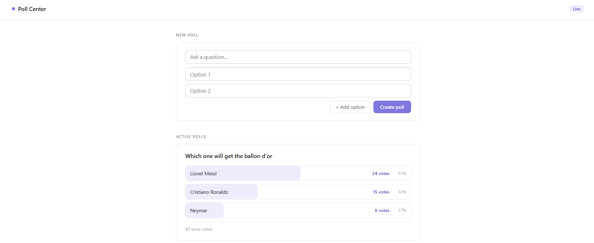

# Poll Center — A Real-Time Polling Application

A clean, minimal polling web application built with Spring Boot and Angular.
Create polls, share options, and vote in real time — with animated vote bars and a modern purple-accented UI.

## Tech Stack

### Backend
- **Java 17+**
- **Spring Boot 3** — application framework
- **Spring MVC** — REST API and request handling
- **Spring Data JPA / Hibernate** — ORM and database access
- **MySQL / PostgresSQL** — relational database
- **Lombok** — boilerplate reduction (`@Data`, `@NoArgsConstructor`, `@RequiredArgsConstructor`)
### Frontend
- **Angular 20** — frontend framework (standalone components, zoneless)
- **Angular Signals** — reactive state management (`signal`, `computed`)
- **Angular Forms** (`FormsModule`) — two-way data binding
- **Angular HttpClient** — REST API communication
## Features

- Create polls with a custom question and any number of options
- Vote on any poll option with a single click
- Animated vote progress bars with live percentage and vote count per option
- Total vote count displayed per poll
- Add or remove options dynamically while creating a poll
- Polls persist across sessions via a Spring Boot REST API and relational database
- Clean, minimal UI with a purple accent theme and sticky navigation bar
